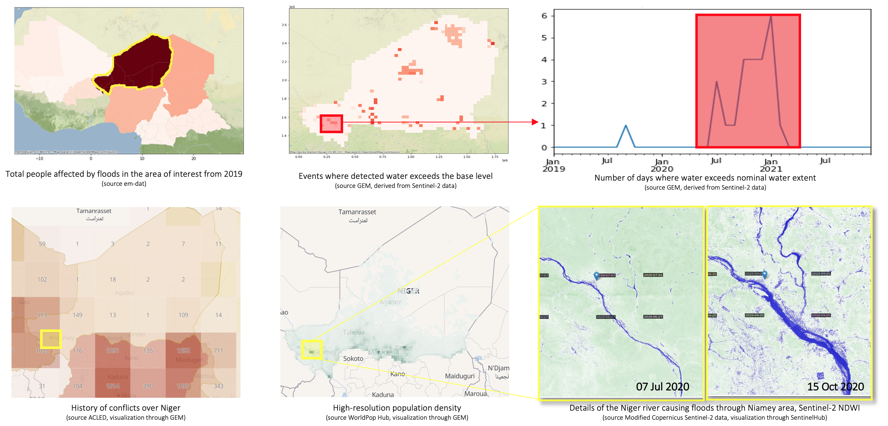
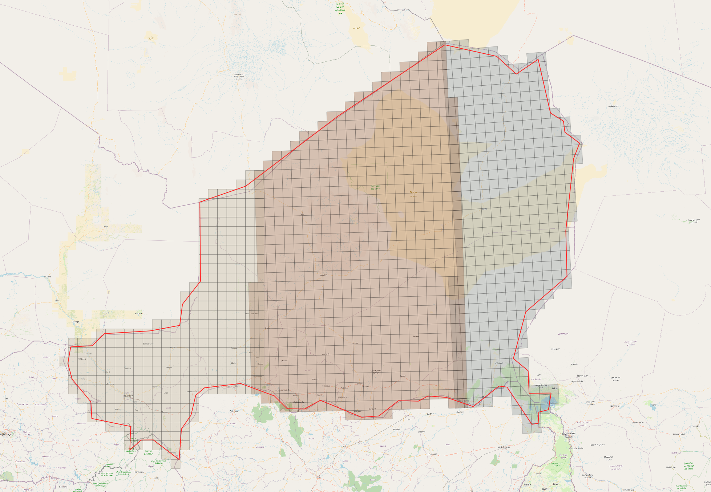
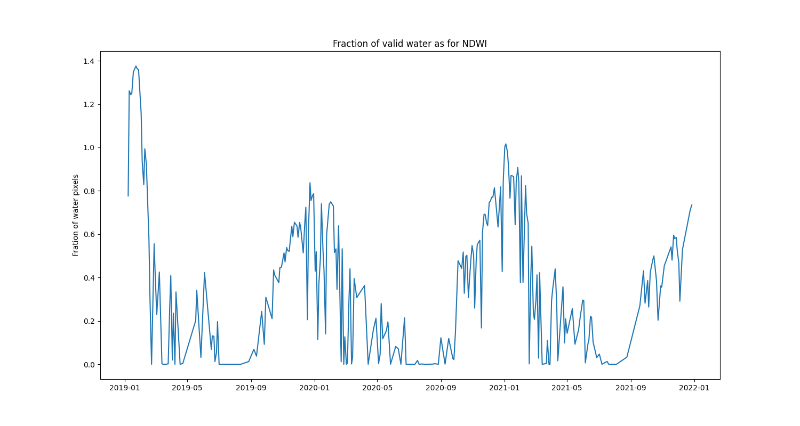

# Continuous monitoring of large areas EO with `eo-grow`

In this part of the example we show a prof-of-concept of using Earth Observation data to
run continuous monitoring of an area.

As a toy example, we consider natural disasters related to the presence or absence
of water, such as floods or droughts, and derive a very simple indicator based on a
water index computed from Sentinel-2 satellite imagery.

In GEM project, in the conflict pre-warning map use-case, the idea is the following:



The image sequence above delineates the following approach:
 * The first image/map provides an overview of the countries most largely affected by floods in
the past years, which showcases Niger as a region heavily affected by such issues;
 * When focusing on Niger, thanks to the continuous monitoring of GEM, the areas prone to
flooding can be identified and anomalies can be extracted automatically, leading to a better
understanding of regions predisposed to floods or drought events;
 * Correlating it with other sources, e.g. high-resolution (1 km) population density areas or
areas with history of conflicts, GEOINT experts anticipate safety and security issues, or
provide better understanding of the scenario;
 * As an example, the level of the river Niger through Niamey during the detected anomalous
event is showcased, which was reported as a flooding affecting over 200k people.

In the example, presented here, we will make use of Sentinel-2 data at low-resolution to quickly
scan the area, create aggregated time series, and use the outcome as input to the next step, the
basic idea of the drill-down mechanism.

## Table of Contents

- [Continuous monitoring of large areas EO with `eo-grow`](#continuous-monitoring-of-large-areas-eo-with-eo-grow)
  - [Table of Contents](#table-of-contents)
- [Workflow](#workflow)
  - [Splitting the AoI](#splitting-the-aoi)
  - [Update the catalog of available imagery](#update-the-catalog-of-available-imagery)
  - [Download the reference data for nominal water levels](#download-the-reference-data-for-nominal-water-levels)
  - [Incremental download of (Sentinel-2) data](#incremental-download-of-sentinel-2-data)
  - [Characterise water levels and aggregate them into time-series](#characterise-water-levels-and-aggregate-them-into-time-series)
  - [Characterise the events and drill-down](#characterise-the-events-and-drill-down)
  - [End to end execution](#end-to-end-execution)
- [Conclusions](#conclusions)


# Workflow

The implemented workflow will derive a simple indicator based on the Normalized Difference
Water Index (NDWI) from Sentinel-2 imagery and a nominal water reference derived from
ESA's World Cover.

For a given area of interest AoI, and time period, we will do the following:

 * split the AoI, e.g. Niger, into a regular grid with given cell size;
 * for each cell update the local catalog of Sentinel-2 (from the last run until now, or from start in case of
the first run)
 * for each cell, download the ESA World Cover 2020 map to extract estimates of _nominal_ water bodies, making
sure to skip this part if the data has already been downloaded
 * for each cell, download the missing Sentinel-2 NDWI images - the newly available imagery since the last
run of the pipeline;
 * for each cell, aggregate pixel-wise information about NDWI-based water surface and nominal water
surface into a dataframe, again only for newly available imagery since the last run;
 * finally we can extract indicators from water information that can aid the characterization of flood/drought events.

Following sections will detail each of the steps.

## Splitting the AoI

This part is performed by `eo-grow` the first time (any) `eo-grow` config is being run. Subsequently, the
resulting grid is cached and reused in next steps. The figure shows how the AoI was split into a regular
grid with cells of size 30km x 30 km, with the global config for continuous monitoring,
[`global_config.json`](../config_files/continuous_monitoring/global_config.json).

Just as in [scaling example](scaling_eo_pipelines.md), do not forget to copy the AoI file
[`niger_aoi.geojson`](../config_files/continuous_monitoring/niger_aoi.geojson) to the `input-data` path of the
`eo-grow` project structure.



## Update the catalog of available imagery

The pipeline configured in [`update_catalog.json`](../config_files/continuous_monitoring/update_catalog.json)
is the baseline of the continuous monitoring service. It will run a Sentinel-Hub
[`Catalog API`](https://docs.sentinel-hub.com/api/latest/api/catalog/) request for each grid cell for the
data collection specified in the config, looking for new data since the last time the pipeline was run.
During the first run, the process will collect all the dates from the specified starting time:

```javascript
{
  // the pipeline class handling the incremental updates
  "pipeline": "gem_example.pipelines.catalog.CatalogPipeline",

  // import the global config
  "**global_config": "${config_path}/global_config.json",

  // storage key (and folder) where to store local catalog
  "input_folder_key": "catalog",

  // "global" start time of continuous monitoring
  "start_time": "2022-01-01",

  // data collecton to track for new data (can be any collection available on Sentinel-Hub)
  "data_collection": "SENTINEL2_L2A",

  // possible filters to add to catalog API request, in this case, cloud cover should be less than 70%
  "catalog_filter": "eo:cloud_cover < 70"
}
```

Running the pipeline, as we have seen already in the large scale processing [example](scaling_eo_pipelines.md),
is straightforward. Without scaling up, the pipeline can be run with

```bash
eogrow config_files/continuous_monitoring/update_catalog.json
```

or, with Ray:
```bash
eogrow-ray infrastructure/cluster.yaml config_files/continuous_monitoring/update_catalog.json
```

## Download the reference data for nominal water levels

The next step is to fetch the data that will be used as the nominal data, which will be used as a baseline; if we
start getting significantly higher fraction of pixels classified as water, then either the nominal data is wrong
or, more important for us, the area is getting flooded. Similarly, significantly higher fraction of pixels not
being above some threshold means that the area is getting very dry.

The reference data download is configured in [`download_nominal_features.json`](../config_files/continuous_monitoring/download_nominal_features.json)
pipeline. To run it, execute

```bash
eogrow-ray infrastructure/cluster.yaml config_files/continuous_monitoring/download_nominal_features.json
```

The important bit in the configuration is the `"skip_existing": true`, as it will skip the `EOPatches` that
already have the data downloaded.

## Incremental download of (Sentinel-2) data

The pipeline, configured in [`incremental_download.json`](../config_files/continuous_monitoring/incremental_download.json)
will - with each run - download only new data, based on the output of the updated catalog from the first
pipeline. In our case it will download the newly available Sentinel-2 NDWI data since the last catalog update:

```javascript
{
  // the pipeline class
  "pipeline": "gem_example.pipelines.incremental_download.IncrementalDownloadPipeline",

  // import the global config
  "**global_config": "${config_path}/global_config.json",

  // the data collection from Sentinel-Hub to (incrementally) download
  "data_collection": "SENTINEL2_L1C",

  // parameters of the download
  "resolution": 120,
  "resampling_type": "BILINEAR",
  "features": [["data", "NDWI"]],
  "compress_level": 1,
  "maxcc": 0.7,
  "time_difference": null,
  "evalscript_path": "${config_path}/evalscript_ndwi.js",

  // skip if already downloaded
  "skip_existing": true,

  // store the output into the specified storage folder
  "output_folder_key": "eopatches",

  // specify the catalog folder/key
  "catalog_folder_key": "catalog"
}
```

Running the pipeline with:

```bash
eogrow-ray infrastructure/cluster.yaml config_files/continuous_monitoring/incremental_download.json
```

will download the new data, and in this case overwrite the existing `EOPatches`. As the next step in
the pipeline is to aggregate the results into time-series, and we do not need the past data any longer,
this approach is the most sensible.


## Characterise water levels and aggregate them into time-series

In this pipeline we will estimate calculate the water levels by calculating the number of "water pixels"
classified from NDWI and reference data (ESA World cover), and then aggregate this information for each
`EOPatch` into a dataframe.

The figure below shows an example time series for water fraction (the ratio of "water pixels" from NDWI vs
the nominal water extent from ESA World cover) for an `EOPatch` cell:




The pipeline is defined in [`compute_indicators.json`](../config_files/continuous_monitoring/compute_indicators.json).
Running it with

```bash
eogrow-ray infrastructure/cluster.yaml config_files/continuous_monitoring/compute_indicators.json
```

we update (or create if run for the first time) the GeoPackage with the observations for each available
(satellite) data we catalogued:

|   water_valid_pixels |   nominal_water_valid_pixels | TIMESTAMP           | eopatch                      | ... |
|---------------------:|-----------------------------:|:--------------------|:-----------------------------|-----|
|                    8 |                           12 | 2022-02-15 10:36:51 | eopatch-id-0000-col-0-row-11 | ... |
|                   23 |                           27 | 2022-02-15 10:37:04 | eopatch-id-0000-col-0-row-11 | ... |
|                    0 |                            0 | 2022-02-20 10:36:57 | eopatch-id-0000-col-0-row-11 | ... |
|                    6 |                           12 | 2022-02-20 10:36:59 | eopatch-id-0000-col-0-row-11 | ... |
|                   20 |                           27 | 2022-02-20 10:37:12 | eopatch-id-0000-col-0-row-11 | ... |


## Characterise the events and drill-down

The resulting GeoPackage could be used to calculate a very simplistic water indicators, as shown in the
figure on the top.

For instance:
 * find where the number of valid pixels with water is significantly higher than the amount of nominal (valid)
water pixels. If this jump is short in time, the area is possibly flooded.
 * find where the number of valid pixels with water is significantly lower than the amount of nominal (valid)
water pixels. If this is happening on a long time period, it can point to droughts.

Simply filtering the resulting GeoPackage by such criteria, one can create a new grid for a new `eo-grow` pipeline
that can be run on higher resolution (e.g. at full Sentinel-2 resolution of 10 m). Such approach represents the
"drill-down" mechanism of `eo-grow`.


## End to end execution

The sections above present a guide to the user, running each of the pipelines separately. A proper service-like
deployment is extracted in an end-to-end[`continuous_monitoring_end2end.json`](../config_files/continuous_monitoring/continuous_monitoring_end2end.json)
config, where the pipelines are chained into one run:

```javascript
[
  {"**catalog_update": "${config_path}/update_catalog.json"},
  {"**incremental_download": "${config_path}/incremental_download.json"},
  {"**esa_worldcover": "${config_path}/download_nominal_features.json"},
  {"**compute_fractions_to_gpkg": "${config_path}/compute_indicators.json"}
]
```

which could then be run as a locally run cron job, or on AWS as an ECS job or even AWS Batch job by simply evoking

```bash
eogrow config_files/continuous_monitoring/continuous_monitoring_end2end.json
```

# Conclusions

This example is a proof of principle how one can construct a continuous monitoring system by regularly polling
the Sentinel-Hub service for new data, and then run a workflow (collection of pipelines) on the new data only.
We know the estimation of water is very simplistic, and more robust methods are required, possibly using
different indices or data sources or even a trained machine learning or deep learning model.
