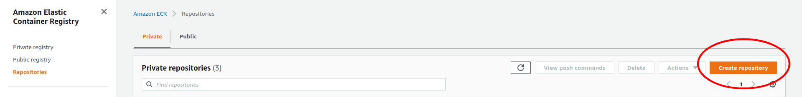
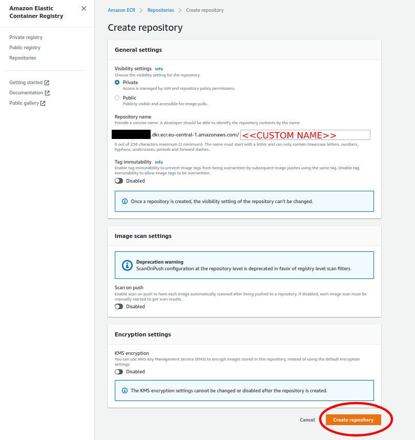
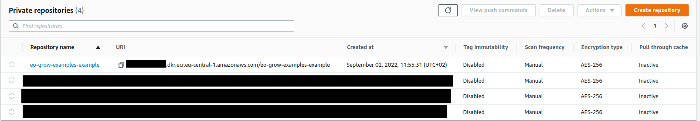

# Setting up the infrastructure for large-scale processing 

One of the  main capabilities of `eo-grow` is its ability to utilize low-cost AWS spot instances together with the `Ray` 
processing framework to perform processing on a large scale. This document outlines the steps needed to set up the 
infrastructure needed for the cloud processing. 

# Main steps 

The following main steps are needed to set up the infrastructure: 

1. Create an AWS [AMI](https://docs.aws.amazon.com/AWSEC2/latest/UserGuide/AMIs.html) on which the Docker image will be run. 
2. Create a Docker image and push it to [AWS Elastic Container Registry](https://aws.amazon.com/ecr/). 
3. Set up the `cluster.yaml` specifying the configuration for the cloud processing. 
4. Run an eo-grow pipeline with the cluster configuration. 

We explain the steps in more detail below. 

## Creating an AWS AMI

To make the process configurable and machine-runnable we use [Packer](https://www.packer.io/) (free and open source 
tool used for creating images on multiple platforms), including AWS. We write a `packer.json`file which we use to 
programmatically create an AMI image on AWS. Below we provide a template file that can be used as a starting point for 
your own file. Values marked as `<< >>` are the ones that need to be filled out to correctly build the AMI image. 
If you have access to an existing AMI with Docker pre-installed this step can be skipped. 

```json
{
  "builders": [{
    "type": "amazon-ebs",
    "access_key": "<< THE AWS_ACCESS_KEY ?? >>",
    "secret_key": "<< THE AWS_SECRET_ACCESS_KEY >>",
    "region": "<< AWS REGION >>",
    "source_ami_filter": {
      "filters": {
        "virtualization-type": "hvm",
        "name": "ubuntu/images/*ubuntu-jammy-22.04-amd64-server-*",
        "root-device-type": "ebs"
      },
      "owners": ["<<AWS ACCOUNT IDs WITH ACCESS TO THE IMAGE>>"],
      "most_recent": true
    },
    "instance_type": "t2.small",
    "ssh_username": "ubuntu",
    "ami_name": "<<NAME OF THE AMI>>",
    "ami_regions": ["<<AWS REGION>>"]
  }],
  "provisioners": [
    {
      "type": "shell",
      "inline_shebang": "/bin/bash -e",
      "inline": [
        "curl -fsSL https://get.docker.com -o get-docker.sh",
        "sh get-docker.sh",
        "sudo usermod -aG docker $USER",
        "sudo systemctl restart docker -f",
        "rm get-docker.sh",
        "sudo apt-get install unzip -y",
        "curl https://awscli.amazonaws.com/awscli-exe-linux-x86_64.zip -o awscliv2.zip",
        "unzip awscliv2.zip && sudo ./aws/install && rm -rf ./aws*"
      ]
    }
  ]
}
```

We can run the packer procedure with the following script. 

```bash
echo "Running packer"

echo "Fetching packer"
wget https://releases.hashicorp.com/packer/1.7.2/packer_1.7.2_linux_amd64.zip
unzip packer_1.7.2_linux_amd64.zip
chmod a+x packer
mv packer /usr/local/bin
export PATH=/usr/local/bin:$PATH

echo "Validating packer json"
packer validate packer.json

echo "Creating AMI"
packer build packer.json
```

These two example files are also available in the repository. 

## Pushing a docker image to ECR

### Creating an ECR repository 

When logged in to the AWS management console, navigate to the `Amazon Elastic Container Registry`.  Once there, only 
two steps are needed for the basic functionality that we need: 

|                                                              |                                 |
| ------------------------------------------------------------ | ------------------------------- |
| Click on the "Create repository button"                      |  |
| Choose a custom name of your ECR repository and click on "Create repository" |   |
| Your ECR repository will now be available via the URL listed. In our example case we created an ECR with a custom name `eo-grow-examples-example`. |               |

### Pushing an image to the  ECR repository 

To push an image to the ECR repository, we need to have a valid Dockerfile (provided in the repository) that we push 
with the following commands: 

```dockerfile
aws configure set aws_access_key_id <<AWS ACCESS KEY ID>>
aws configure set aws_secret_access_key <<AWS SECRET ACCESS_KEY>>
aws configure set region <<AWS REGION>>
aws ecr get-login-password | docker login
        --username AWS
        --password-stdin <<OWNER AWS ACCOUNT ID>>.dkr.ecr.eu-central-1.amazonaws.com
    - docker build --no-cache -f=./Dockerfile --tag=<<USER SPECIFIED IMAGE TAG>>
        --build-arg SH_CLIENT_ID=<<YOUR SH CLIENT ID>>
        --build-arg SH_CLIENT_SECRET=<<YOUR SH CLIENT SECRET>>
        --build-arg EOGROW_EXAMPLES_BRANCH=<<THE BRANCH OF THIS REPOSITORY, USUALLY MAIN>>
    - docker tag <<USER SPECIFIED IMAGE TAG (SAME AS ABOVE)>> <<OWNER AWS ACCOUNT ID>>.dkr.ecr.eu-central-1.amazonaws.com/<<USER SPECIFIED IMAGE TAG (SAME AS ABOVE)>>
    - docker push <<OWNER AWS ACCOUNT ID>>.dkr.ecr.<<AWS REGION>>.amazonaws.com/<<USER SPECIFIED IMAGE TAG (SAME AS ABOVE)>>
    - echo <<USER SPECIFIED IMAGE TAG (SAME AS ABOVE)>>
```

Once this has been done, your Docker image is available under the following URL : 

`<<OWNER AWS ACCOUNT ID}>>.dkr.ecr.<<AWS REGION>>.amazonaws.com/<<USER SPECIFIED IMAGE TAG (SAME AS ABOVE)>>`

## Preparing the cluster.yaml file

We have prepared a template for the `cluster.yaml` file that can be used for running `eo-grow` pipelines on the cloud. 
As before, the values marked inside `<< >>` need to be set by the user. The number of workers (instances) and their 
type can be controlled through the  `max_workers` parameter in the root and under the `ray.worker` section of the 
configuration file. This should depend on the specifics of your pipeline and on the scale.

```yaml
# For info about parameters check https://docs.ray.io/en/latest/cluster/config.html#full-configuration

cluster_name: gem-example-cluster

max_workers: 10  # Max number of worker instances
upscaling_speed: 1.0
idle_timeout_minutes: 5

docker:
    image: "<<The Docker image URL to the ECR (as specified in the section above)>>
    container_name: "gem-example"
    pull_before_run: True

provider:
    type: aws
    region: eu-central-1 # !! Can also be other regions, if you are running elsewhere !! 
    availability_zone: eu-central-1a,eu-central-1b,eu-central-1c
    cache_stopped_nodes: False  # Change for terminating instances

available_node_types:
    ray.head:
        min_workers: 0
        max_workers: 0
        node_config:
            InstanceType: m5.2xlarge
            ImageId: << ID OF THE AMI CREATED IN THE FIRST STEP>> 
            BlockDeviceMappings:
                - DeviceName: /dev/sda1
                  Ebs:
                      VolumeSize: 40        
        resources: {"CPU": 1}
    ray.worker:
        min_workers: 0
        max_workers: 40  # Max number of workers of this type
        node_config:
            InstanceType: c5.large
            ImageId:  << ID OF THE AMI CREATED IN THE FIRST STEP>> 
            InstanceMarketOptions:
                MarketType: spot
            BlockDeviceMappings:
                - DeviceName: /dev/sda1
                  Ebs:
                    VolumeSize: 40
        resources: {}

head_node_type: ray.head

file_mounts: {}
cluster_synced_files: []
file_mounts_sync_continuously: False
rsync_exclude:
    - "**/.git"
    - "**/.git/**"
rsync_filter:
    - ".gitignore"

initialization_commands:
    - aws ecr get-login-password | docker login --username AWS --password-stdin <<AWS ACCOUNT>>.dkr.ecr.<<AWS REGION>>.amazonaws.com

setup_commands: []

head_setup_commands: []

worker_setup_commands: []

head_start_ray_commands:
    - ray stop
    - ulimit -n 65536; ray start --head --port=6379 --object-manager-port=8076 --autoscaling-config=~/ray_bootstrap_config.yaml

worker_start_ray_commands:
    - ray stop
    - ulimit -n 65536; ray start --address=$RAY_HEAD_IP:6379 --object-manager-port=8076

head_node: {}
worker_nodes: {}
```

## Running en eo-grow pipeline on the cluster

After the `cluster.yaml` file has been specified we can simply run it by calling the `eogrow-ray` command and 
specifying the cluster configuration and the pipeline config. For example: 

```bash
eogrow-ray infrastructure/cluster.yaml config_files/large_scale_processing/sampling/sampling.json --start
```

We can then check the execution status by calling:

```bash
ray attach infrastructure/cluster.yaml
```

which should open up the console.  Once the execution has finished, the workers are shut down automatically, but we need 
to shut down the head node manually by calling `ray down` and specifying the `cluster.yaml` configuration. For example:  

```bash
ray down infrastructure/cluster.yaml
```