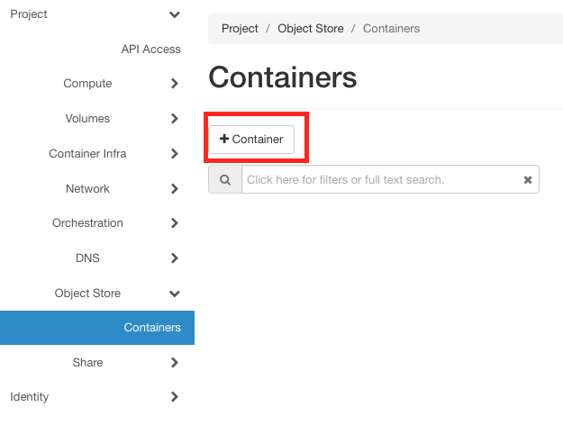
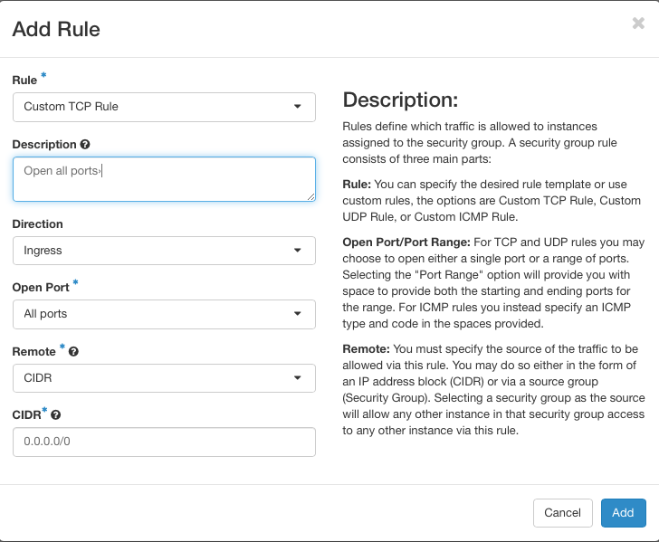
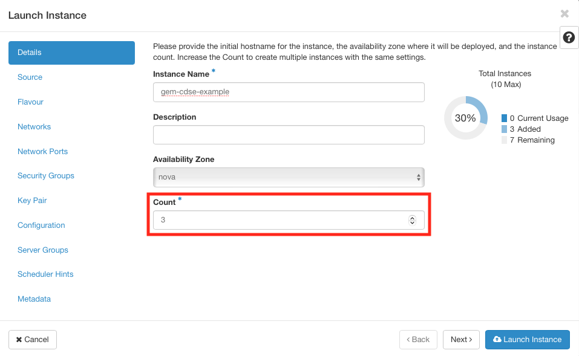

# Setting up the infrastructure for large-scale processing

One of the  main capabilities of `eo-grow` is its ability to utilize cloud providers for performing processing on a large scale. We can either use the capabilities of the [CDSE]( https://dataspace.copernicus.eu/ecosystem) platform to create instances and delegate processing to the cloud or we can utilize  AWS (or other commercial cloud providers) spot instances together with the `Ray`processing framework to perform processing on a large scale. This document outlines the steps needed to set up the infrastructure needed for the cloud processing on CDSE and on AWS.

## Table of contents

- [Setting up the infrastructure for large-scale processing](#setting-up-the-infrastructure-for-large-scale-processing)
  - [Table of contents](#table-of-contents)
  - [Copernicus Data Space Ecosystem](#copernicus-data-space-ecosystem)
    - [Main steps](#main-steps)
      - [Create storage container and associated credentials](#create-storage-container-and-associated-credentials)
      - [Creating instances on CDSE](#creating-instances-on-cdse)
      - [Set up the `cluster.yaml` specifying the configuration for the cloud processing.](#set-up-the-clusteryaml-specifying-the-configuration-for-the-cloud-processing)
  - [AWS](#aws)
    - [Main steps](#main-steps-1)
      - [Creating an AWS AMI](#creating-an-aws-ami)
      - [Pushing a docker image to ECR](#pushing-a-docker-image-to-ecr)
        - [Creating an ECR repository](#creating-an-ecr-repository)
        - [Pushing an image to the  ECR repository](#pushing-an-image-to-the--ecr-repository)
      - [Preparing the cluster.yaml file](#preparing-the-clusteryaml-file)
  - [Running en eo-grow pipeline on the cluster](#running-en-eo-grow-pipeline-on-the-cluster)

## Copernicus Data Space Ecosystem

### Main steps

The following main steps are needed to set up the infrastructure:

Create and  run the instances on CDSE that will be used for processing

1. Create Storage container and associated credentials
2. Create and  run the instances on CDSE that will be used for processing
3. Set up the `cluster.yaml` specifying the configuration for the cloud processing.
4. Run an eo-grow pipeline with the cluster configuration.

We explain the steps in more detail below.

#### Create storage container and associated credentials

The container needs to be created in the `WAW3-1`  region.  Creating a container is simple. Go to Object store -> Containers and click on (+ Container) button.



then just give it a name of your choice and select  Submit. We recommend that you leave the access as "Not public" unless you are sure that you want to share the container contents publicly.


After the container has been created, we need to create EC2 Credentials which we will use to access the bucket. The instructions on how this can be done are available [here](https://creodias.eu/-/how-to-generate-ec2-credentials-?redirect=https%3A%2F%2Fcreodias.eu%2Fknowledgebase%3Fp_p_id%3D3%26p_p_lifecycle%3D0%26p_p_state%3Dmaximized%26p_p_mode%3Dview%26_3_redirect%3D%252Fknowledgebase%253Fp_p_id%253D3%2526p_p_lifecycle%253D0%2526p_p_state%253Dnormal%2526p_p_mode%253Dview%2526_3_groupId%253D0%26_3_keywords%3Dec2%26_3_groupId%3D0%26_3_struts_action%3D%252Fsearch%252Fsearch&inheritRedirect=true). The created access and secret keys will be needed in the next steps.

The last step is to give Sentinel Hub permissions to access the bucket. This can be done by running the following Python script. Make sure to fill out the `access_key`,`secret_key`, `bucket_name` variables with the ones created.

```python
"""
Script to set bucket policy on CreoDIAS bucket
"""
# Change the access key, secret_key and bucket_name

from pprint import pprint
import boto3
import json

access_key = "<INSERT YOUR ACCESS KEY HERE>"  # OpenStack secret key obtained in the previous step
secret_key = "<INSERT YOUR SECRET KEY HERE>"  # OpenStack secret key obtained in the previous step
bucket_name = "<INSERT THE NAME OF YOUR CONTAINER HERE>"  # name of the created container
host = "https://s3.waw3-1.cloudferro.com/"

s3 = boto3.client(
    "s3",
    aws_access_key_id=access_key,
    aws_secret_access_key=secret_key,
    endpoint_url=host,
)

# share a bucket
share_to = "ddf4c98b5e6647f0a246f0624c8341d9"

bucket_policy = {
    "Version": "2012-10-17",
    "Statement": [
        {
            "Sid": "Sentinel Hub permissions",
            "Effect": "Allow",
                  "Principal": {
                    "AWS": [
                        f"arn:aws:iam::{share_to}:root"
                        ]
              },
            "Action": [
                "s3:GetBucketLocation",
                "s3:ListBucket",
                "s3:PutObject",
                "s3:GetObject",
            ],
            "Resource": [
                f"arn:aws:s3:::{bucket_name}",
                f"arn:aws:s3:::{bucket_name}/*",
            ],
        }
    ],
}

# Convert the policy from JSON dict to string
bucket_policy = json.dumps(bucket_policy)

# Set the new policy
s3.put_bucket_policy(
    Bucket=bucket_name,
    Policy=bucket_policy,
)

result = s3.get_bucket_policy(Bucket=bucket_name)
pprint(result["Policy"])
```

#### Creating instances on CDSE

The majority of the procedure is already explain in the [eo-grow on Copernicus Data Space Ecosystem](setting-up-cdse.md)  notebook. If you did not go through that notebook, please do so. The prerequisites for this procedure is to:

1) Setup the network so it can be accessible from the internet. [Link to instructions](setting-up-cdse.md#network-setup)

2) Setup the security groups.  [Link to instructions](setting-up-cdse.md#security-groups)

   - **For Ray, we  we need to add another Ingress rule to make ALL the ports accessible from everywhere. See screenshot below. **

     

3. Create a Key Pair. [Link to instructions](setting-up-cdse.md#key-pairs)

4. Create instances and assign public IPs to the istances.. [Link to instructions](setting-up-cdse.md#creating-a-vm)

   - The instructions are made for creating one instance. We can use eo-grow with more instances for faster processing. To create multiple instances at once, you need to adjust the `Count`  window in the instance creation window.  Note that we need to assign the public IPs for each instance separately.

     

#### Set up the `cluster.yaml` specifying the configuration for the cloud processing.

Below we can see a template of the `cluster.yaml` file that can be used to run a ray cluster on CDSE.

The user needs to fill out the following:

* `provider.head_ip` : Fill it with the IP of the head node. The head node can be chosen arbitrarily from the instances that were created in the previous step.
* `provider.worker_ips`: Fill it with the list of of worker IPs, i.e. the rest of the instances that were created in the previous step.
* `auth.ssh_private_key`: Provide a local path to your [Key Pair](setting-up-cdse.md#key-pairs).
* `setup_commands`: You need to insert your access and secret keys into the last command. The command will create a default profile that will be utilized by eo-grow storage manager.

The entries that need to be filled out are also marked in the template with `<>`

```yaml
# A unique identifier for the head node and workers of this cluster.
cluster_name: ray-cdse

docker:
    image: "rayproject/ray:latest-py39-cpu"
    # image: rayproject/ray:latest-gpu   # use this one if you don't need ML dependencies, it's faster to pull
    container_name: "ray_container"
    # If true, pulls latest version of image. Otherwise, `docker run` will only pull the image
    # if no cached version is present.
    pull_before_run: True
    run_options:   # Extra options to pass into "docker run"
        - --ulimit nofile=65536:65536

provider:
    type: local
    head_ip: <IP of the head node>
    worker_ips: [<LIST OF WORKER IPS>]

# How Ray will authenticate with newly launched nodes.
auth:
    ssh_user: eouser
    ssh_private_key: <LOCAL_PATH_TO_YOUR_KEYFILE> (i.e. ~/.ssh/gem-example-keypair.pem)

# The autoscaler will scale up the cluster faster with higher upscaling speed.
# E.g., if the task requires adding more nodes then autoscaler will gradually
# scale up the cluster in chunks of upscaling_speed*currently_running_nodes.
# This number should be > 0.
upscaling_speed: 1.0
idle_timeout_minutes: 5

# Files or directories to copy to the head and worker nodes. The format is a
# dictionary from REMOTE_PATH: LOCAL_PATH. E.g. you could save your conda env to an environment.yaml file, mount
# that directory to all nodes and call `conda -n my_env -f /path1/on/remote/machine/environment.yaml`. In this
# example paths on all nodes must be the same (so that conda can be called always with the same argument)
file_mounts: {
#    "/path1/on/remote/machine": "/path1/on/local/machine",
#    "/path2/on/remote/machine": "/path2/on/local/machine",
}

# Files or directories to copy from the head node to the worker nodes. The format is a
# list of paths. The same path on the head node will be copied to the worker node.
# This behavior is a subset of the file_mounts behavior. In the vast majority of cases
# you should just use file_mounts. Only use this if you know what you're doing!
cluster_synced_files: []

# Whether changes to directories in file_mounts or cluster_synced_files in the head node
# should sync to the worker node continuously
file_mounts_sync_continuously: False

# Patterns for files to exclude when running rsync up or rsync down
rsync_exclude:
    - "**/.git"
    - "**/.git/**"

# Pattern files to use for filtering out files when running rsync up or rsync down. The file is searched for
# in the source directory and recursively through all subdirectories. For example, if .gitignore is provided
# as a value, the behavior will match git's behavior for finding and using .gitignore files.
rsync_filter:
    - ".gitignore"

# List of commands that will be run before `setup_commands`. If docker is
# enabled, these commands will run outside the container and before docker
# is setup.
initialization_commands:
    - sudo apt -y install docker.io
    - sudo [ $(getent group docker) ] || sudo groupadd docker
    - sudo usermod -aG docker ${USER}
    - sudo systemctl restart docker.service

# List of shell commands to run to set up each nodes.
setup_commands:
    - git clone -b feat/ray-testing-dummy https://github.com/sentinel-hub/eo-grow-examples.git
    - pip install -e eo-grow-examples/GEM/
    - sudo apt-get update
    - sudo apt -y install awscli
    - mkdir ~/.aws/
    - echo -e "\n[default]\naws_access_key_id = <YOUR ACCESS KEY>\naws_secret_access_key = <YUUR SECRET KEY>" >> ~/.aws/credentials
    # If we have e.g. conda dependencies stored in "/path1/on/local/machine/environment.yaml", we can prepare the
    # work environment on each worker by:
    #   1. making sure each worker has access to this file i.e. see the `file_mounts` section
    #   2. adding a command here that creates a new conda environment on each node or if the environment already exists,
    #     it updates it:
    #      conda env create -q -n my_venv -f /path1/on/local/machine/environment.yaml || conda env update -q -n my_venv -f /path1/on/local/machine/environment.yaml
    #
    # Ray developers:
    # you probably want to create a Docker image that
    # has your Ray repo pre-cloned. Then, you can replace the pip installs
    # below with a git checkout <your_sha> (and possibly a recompile).
    # To run the nightly version of ray (as opposed to the latest), either use a rayproject docker image
    # that has the "nightly" (e.g. "rayproject/ray-ml:nightly-gpu") or uncomment the following line:
    # - pip install -U "ray[default] @ https://s3-us-west-2.amazonaws.com/ray-wheels/latest/ray-3.0.0.dev0-cp37-cp37m-manylinux2014_x86_64.whl"

# Custom commands that will be run on the head node after common setup.
head_setup_commands: []

# Custom commands that will be run on worker nodes after common setup.
worker_setup_commands: []

# Command to start ray on the head node. You don't need to change this.
head_start_ray_commands:
  # If we have e.g. conda dependencies, we could create on each node a conda environment (see `setup_commands` section).
  # In that case we'd have to activate that env on each node before running `ray`:
  # - conda activate my_venv && ray stop
  # - conda activate my_venv && ulimit -c unlimited && ray start --head --port=6379 --autoscaling-config=~/ray_bootstrap_config.yaml
    - ray stop
    - ulimit -c unlimited && ray start --head --port=6379 --autoscaling-config=~/ray_bootstrap_config.yaml

# Command to start ray on worker nodes. You don't need to change this.
worker_start_ray_commands:
  # If we have e.g. conda dependencies, we could create on each node a conda environment (see `setup_commands` section).
  # In that case we'd have to activate that env on each node before running `ray`:
  # - conda activate my_venv && ray stop
  # - ray start --address=$RAY_HEAD_IP:6379
    - ray stop
    - ray start --address=$RAY_HEAD_IP:6379
```


## AWS

### Main steps

The following main steps are needed to set up the infrastructure:

1. Create an AWS [AMI](https://docs.aws.amazon.com/AWSEC2/latest/UserGuide/AMIs.html) on which the Docker image will be run.
2. Create a Docker image and push it to [AWS Elastic Container Registry](https://aws.amazon.com/ecr/).
3. Set up the `cluster.yaml` specifying the configuration for the cloud processing.
4. Run an eo-grow pipeline with the cluster configuration.

We explain the steps in more detail below.

#### Creating an AWS AMI

To make the process configurable and machine-runnable we use [Packer](https://www.packer.io/) (free and open source
tool used for creating images on multiple platforms), including AWS. We write a `packer.json`file which we use to
programmatically create an AMI image on AWS. Below we provide a template file that can be used as a starting point for
your own file. Values marked as `<< >>` are the ones that need to be filled out to correctly build the AMI image.
If you have access to an existing AMI with Docker pre-installed this step can be skipped.

```json
{
  "builders": [{
    "type": "amazon-ebs",
    "access_key": "<< THE AWS_ACCESS_KEY ?? >>",
    "secret_key": "<< THE AWS_SECRET_ACCESS_KEY >>",
    "region": "<< AWS REGION >>",
    "source_ami_filter": {
      "filters": {
        "virtualization-type": "hvm",
        "name": "ubuntu/images/*ubuntu-jammy-22.04-amd64-server-*",
        "root-device-type": "ebs"
      },
      "owners": ["<<AWS ACCOUNT IDs WITH ACCESS TO THE IMAGE>>"],
      "most_recent": true
    },
    "instance_type": "t2.small",
    "ssh_username": "ubuntu",
    "ami_name": "<<NAME OF THE AMI>>",
    "ami_regions": ["<<AWS REGION>>"]
  }],
  "provisioners": [
    {
      "type": "shell",
      "inline_shebang": "/bin/bash -e",
      "inline": [
        "curl -fsSL https://get.docker.com -o get-docker.sh",
        "sh get-docker.sh",
        "sudo usermod -aG docker $USER",
        "sudo systemctl restart docker -f",
        "rm get-docker.sh",
        "sudo apt-get install unzip -y",
        "curl https://awscli.amazonaws.com/awscli-exe-linux-x86_64.zip -o awscliv2.zip",
        "unzip awscliv2.zip && sudo ./aws/install && rm -rf ./aws*"
      ]
    }
  ]
}
```

We can run the packer procedure with the following script.

```bash
echo "Running packer"

echo "Fetching packer"
wget https://releases.hashicorp.com/packer/1.7.2/packer_1.7.2_linux_amd64.zip
unzip packer_1.7.2_linux_amd64.zip
chmod a+x packer
mv packer /usr/local/bin
export PATH=/usr/local/bin:$PATH

echo "Validating packer json"
packer validate packer.json

echo "Creating AMI"
packer build packer.json
```

These two example files are also available in the repository.

#### Pushing a docker image to ECR

##### Creating an ECR repository

When logged in to the AWS management console, navigate to the `Amazon Elastic Container Registry`.  Once there, only
two steps are needed for the basic functionality that we need:

|                                                              |                                 |
| ------------------------------------------------------------ | ------------------------------- |
| Click on the "Create repository button"                      |  |
| Choose a custom name of your ECR repository and click on "Create repository" |   |
| Your ECR repository will now be available via the URL listed. In our example case we created an ECR with a custom name `eo-grow-examples-example`. |               |

##### Pushing an image to the  ECR repository

To push an image to the ECR repository, we need to have a valid Dockerfile (provided in the repository) that we push
with the following commands:

```dockerfile
aws configure set aws_access_key_id <<AWS ACCESS KEY ID>>
aws configure set aws_secret_access_key <<AWS SECRET ACCESS_KEY>>
aws configure set region <<AWS REGION>>
aws ecr get-login-password | docker login
        --username AWS
        --password-stdin <<OWNER AWS ACCOUNT ID>>.dkr.ecr.eu-central-1.amazonaws.com
    - docker build --no-cache -f=./Dockerfile --tag=<<USER SPECIFIED IMAGE TAG>>
        --build-arg SH_CLIENT_ID=<<YOUR SH CLIENT ID>>
        --build-arg SH_CLIENT_SECRET=<<YOUR SH CLIENT SECRET>>
        --build-arg EOGROW_EXAMPLES_BRANCH=<<THE BRANCH OF THIS REPOSITORY, USUALLY MAIN>>
    - docker tag <<USER SPECIFIED IMAGE TAG (SAME AS ABOVE)>> <<OWNER AWS ACCOUNT ID>>.dkr.ecr.eu-central-1.amazonaws.com/<<USER SPECIFIED IMAGE TAG (SAME AS ABOVE)>>
    - docker push <<OWNER AWS ACCOUNT ID>>.dkr.ecr.<<AWS REGION>>.amazonaws.com/<<USER SPECIFIED IMAGE TAG (SAME AS ABOVE)>>
    - echo <<USER SPECIFIED IMAGE TAG (SAME AS ABOVE)>>
```

Once this has been done, your Docker image is available under the following URL :

`<<OWNER AWS ACCOUNT ID}>>.dkr.ecr.<<AWS REGION>>.amazonaws.com/<<USER SPECIFIED IMAGE TAG (SAME AS ABOVE)>>`

#### Preparing the cluster.yaml file

We have prepared a template for the `cluster.yaml` file that can be used for running `eo-grow` pipelines on the cloud.
As before, the values marked inside `<< >>` need to be set by the user. The number of workers (instances) and their
type can be controlled through the  `max_workers` parameter in the root and under the `ray.worker` section of the
configuration file. This should depend on the specifics of your pipeline and on the scale.

```yaml
# For info about parameters check https://docs.ray.io/en/latest/cluster/config.html#full-configuration

cluster_name: gem-example-cluster

max_workers: 10  # Max number of worker instances
upscaling_speed: 1.0
idle_timeout_minutes: 5

docker:
    image: "<<The Docker image URL to the ECR (as specified in the section above)>>
    container_name: "gem-example"
    pull_before_run: True

provider:
    type: aws
    region: eu-central-1 # !! Can also be other regions, if you are running elsewhere !!
    availability_zone: eu-central-1a,eu-central-1b,eu-central-1c
    cache_stopped_nodes: False  # Change for terminating instances

available_node_types:
    ray.head:
        min_workers: 0
        max_workers: 0
        node_config:
            InstanceType: m5.2xlarge
            ImageId: << ID OF THE AMI CREATED IN THE FIRST STEP>>
            BlockDeviceMappings:
                - DeviceName: /dev/sda1
                  Ebs:
                      VolumeSize: 40
        resources: {"CPU": 1}
    ray.worker:
        min_workers: 0
        max_workers: 40  # Max number of workers of this type
        node_config:
            InstanceType: c5.large
            ImageId:  << ID OF THE AMI CREATED IN THE FIRST STEP>>
            InstanceMarketOptions:
                MarketType: spot
            BlockDeviceMappings:
                - DeviceName: /dev/sda1
                  Ebs:
                    VolumeSize: 40
        resources: {}

head_node_type: ray.head

file_mounts: {}
cluster_synced_files: []
file_mounts_sync_continuously: False
rsync_exclude:
    - "**/.git"
    - "**/.git/**"
rsync_filter:
    - ".gitignore"

initialization_commands:
    - aws ecr get-login-password | docker login --username AWS --password-stdin <<AWS ACCOUNT>>.dkr.ecr.<<AWS REGION>>.amazonaws.com

setup_commands: []

head_setup_commands: []

worker_setup_commands: []

head_start_ray_commands:
    - ray stop
    - ulimit -n 65536; ray start --head --port=6379 --object-manager-port=8076 --autoscaling-config=~/ray_bootstrap_config.yaml

worker_start_ray_commands:
    - ray stop
    - ulimit -n 65536; ray start --address=$RAY_HEAD_IP:6379 --object-manager-port=8076

head_node: {}
worker_nodes: {}
```

## Running en eo-grow pipeline on the cluster

After the `cluster.yaml` file has been specified we can simply run it by calling the `eogrow-ray` command and
specifying the cluster configuration and the pipeline config. This works the same regardless we are using CDSE or AWS cluster.

 For example:

```bash
eogrow-ray infrastructure/cluster.yaml config_files/large_scale_processing/sampling/sampling.json --start
```

We can then check the execution status by calling:

```bash
ray attach infrastructure/cluster.yaml
```

which should open up the console.  Once the execution has finished, the workers are shut down automatically, but we need
to shut down the head node manually by calling `ray down` and specifying the `cluster.yaml` configuration. For example:

```bash
ray down infrastructure/cluster.yaml
```
