## Scaling up EO with `eo-grow` and `Ray`

This readme contains information on running an end to end generic EO workflow using `eo-grow` with Ray clusters on AWS
infrastructure. The first step, detailing the instructions on setting up AWS instances to scale-up processing, is given
[here](infrastructure.md). There are three main steps to be done before running an `eo-grow` pipeline:

1. Create an AWS Amazon Machine Image (AMI).
2. Create a Docker image and push it to AWS Elastic Container Registry (ECR).
3. Set up the `cluster.yaml` specifying the configuration for the cloud processing.

Once these are completed, one can run `eo-grow` pipelines on a cluster of AWS EC2 (spot) instances.

In the following sections, we will outline the pipelines one needs to run to get a (simple)
 built-up classifier on scale. All the code and all the configuration files with input parameters
 are available in this repository. Also, trying out parts of this example can be done locally,
 without relying on `Ray`, AWS or computing cluster.

### Table of contents

- [Scaling up EO with `eo-grow` and `Ray`](#scaling-up-eo-with-eo-grow-and-ray)
  - [Table of contents](#table-of-contents)
- [Prepare the project](#prepare-the-project)
  - [Storage Manager](#storage-manager)
  - [Area Manager](#area-manager)
  - [Logging Manager](#logging-manager)
- [The example](#the-example)
  - [Pipeline 1 - Creating the Data Cube](#pipeline-1---creating-the-data-cube)
  - [Pipeline 2 - Loading the Data Cube into `EOPatches`](#pipeline-2---loading-the-data-cube-into-eopatches)
  - [Pipeline 3 - Calculating features](#pipeline-3---calculating-features)
  - [Pipeline 4 - Retrieving reference data](#pipeline-4---retrieving-reference-data)
  - [Pipelines 5 - ML cycle](#pipelines-5---ml-cycle)
    - [Sampling pipeline](#sampling-pipeline)
    - [Merging the samples for training](#merging-the-samples-for-training)
    - [Training pipeline](#training-pipeline)
  - [Pipeline 6 - Running predictions](#pipeline-6---running-predictions)
  - [Pipeline 7 - Exporting Maps](#pipeline-7---exporting-maps)
  - [Pipeline 8 - Ingesting Maps to Sentinel Hub](#pipeline-8---ingesting-maps-to-sentinel-hub)
- [Conclusion](#conclusion)


## Prepare the project

`eo-grow` facilitates reproducibility, and was constructed in a way that allows almost "no-code"
development, particularly when we were able to generalise the Earth Observation processing pipelines to
be implemented, as in such cases the only "code" to implement are just configuration files, specifying
the input variables to the various pipelines.

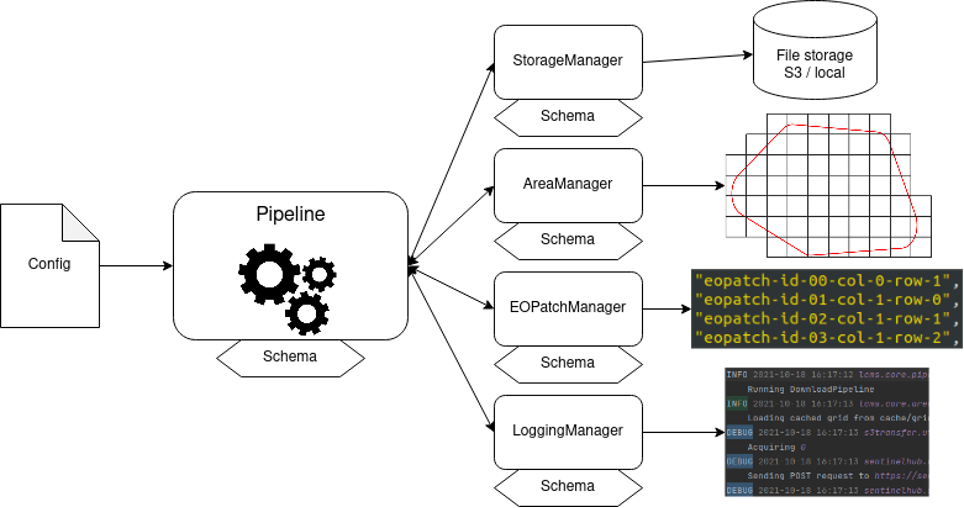

The main parts of the configuration are the specifications of the managers, Python classes that allow
`eo-grow` to handle structured data storage, `EOPatches` (data structures of `eo-learn`), area manager,
linking the area of interest with `EOPatches` and logging manager.

In this example, the parameters for these managers are specified in the
[`global_config.json`](../config_files/large_scale_processing/global_config.json) file. Let's take a closer look.

### Storage Manager

Storage manager defines the project structure on disk or on object storage (AWS S3 bucket). The
config language of `eo-grow` builds on top of `JSON` format, one can also make use of comments,
suitable to document the parts:

```javascript
"storage": {
    // the StorageManager class to be used
    "manager": "eogrow.core.storage.StorageManager",

    // the bucket needs to be properly configured for Sentinel Hub Batch API
    // it could also be a local folder, but most probably your local machine will
    // only be sufficient to process a test run of the pipelines on single eo-patch
    "project_folder": "s3://<your bucket>",

    // the structure of the project; in the end, the folders will look like so:
    // project_folder/data/2020
    //               /tiffs/2020
    //               /...
    //               /maps
    // each folder is accessible through the code via storage manager by the key,
    // e.g. `storage_manager.get_folder("training")` will return `project_folder/training-data`
    "structure": {
        "data": "data/${var:year}",  // uses the 2020 defined in "variables"
        "tiffs": "tiffs/${var:year}",
        "features": "features/${var:year}",
        "features_sampled": "features-sampled/${var:year}",
        "raster_reference": "raster-reference",
        "training": "training-data",
        "models": "models",
        "predictions": "predictions",
        "maps": "maps"
    }
}
```

Particularly the `StorageManager` is responsible for well-structured experiments when doing research.
All the sub-folders of the project are reflected by the manager, in the code referenced by the keys
from the config, and the config itself provides a description of where is (what kind of) data.

### Area Manager

Area manager defines the area of interest and how it should be split into `EOPatches`. For this example
the AOI is covering part of West Africa region, as can be seen below:

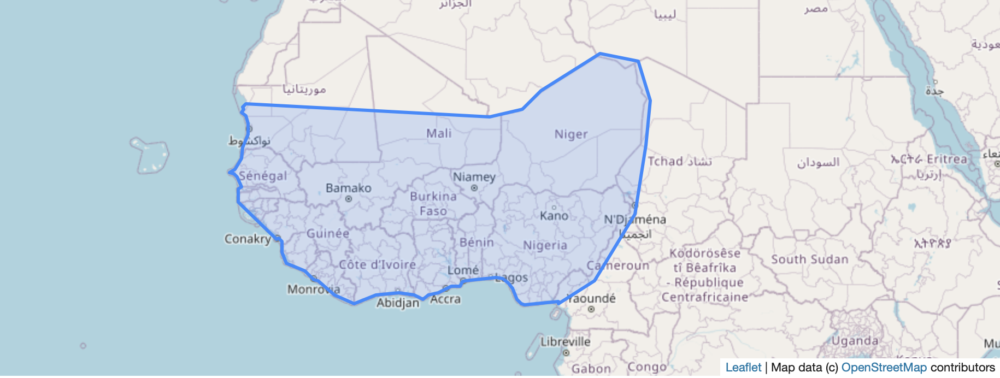

The AOI needs to be stored in `project_folder/input-data/`, and is specified as input parameter in the
AreaManager part of the global config:

```javascript
"area": {
    // the AreaManager class to be used
    "manager": "eogrow.core.area.BatchAreaManager",

    // the geojson file with the area of interest
    "area": {
      "filename": "aoi_region.geojson"
    },

    // as we are using Batch Area Manager, this parameter specifies the tiling grid to be used,
    // see https://docs.sentinel-hub.com/api/latest/api/batch/#tiling-grids
    "tiling_grid_id": 2,

    // pixel resolution for the selected tiling grid
    "resolution": 120,

    // buffer (in pixels)
    "tile_buffer_x": 10,
    "tile_buffer_y": 10
}
```

### Logging Manager

`eo-grow` provides concise logging functionality, which makes possible the post-mortem analysis of the
whole processing. In our case, we will be both logging and showing the errors (e.g. in standard output
stream):

```javascript
"logging": {
    // the logging manager class
    "manager": "eogrow.core.logging.LoggingManager",
    "save_logs": true,
    "show_logs": true
}
```

## The example

The example presented here runs the processing as depicted here:

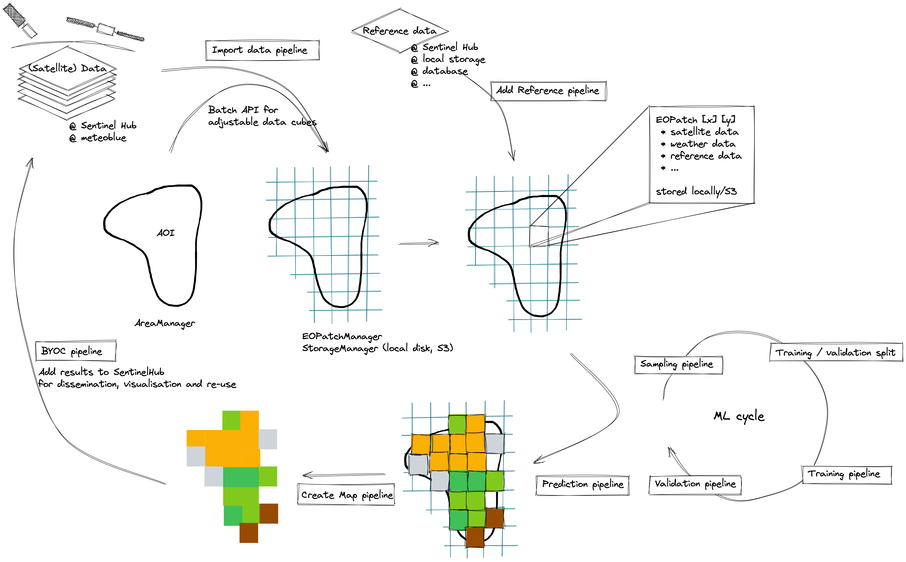

It consists of several pipelines, namely:

 1) Creating data cube from Sentinel-2 imagery over AOI, for year 2020
 2) Loading the results from the cube into `EOPatches`
 3) Calculating features from the raw data
 4) Retrieving reference data
 5) The pipelines for ML cycle:
    5a) Sampling pipeline
    5b) Preparing data for training
    5c) Training of the model
 6) Running prediction over AOI
 7) Exporting maps
 8) Ingesting results back to Sentinel Hub

In the subsections we will walk you through each step, detailing the configuration for each pipeline,
and give you the command-line instructions to test and run the pipeline.


### Pipeline 1 - Creating the Data Cube

In this first pipeline we will make use of Sentinel Hub Batch Processing API to request satellite data
over AOI and selected time period. The [config file](../config_files/large_scale_processing/input_data/eo_data.json) specifies
the class, where the pipeline is implemented

```javascript
"pipeline": "eogrow.pipelines.download_batch.BatchDownloadPipeline"
```

and a number of parameters for that class:

```javascript
// which storage manager key to use for output
"output_folder_key": "tiffs",
"inputs": [{
    // 120m global mosaic, https://collections.sentinel-hub.com/sentinel-s2-l2a-mosaic-120/
    "data_collection": "BYOC_484d8dbb-9e3e-41f2-b96b-35189d3ae37f",
    "resampling_type": "BILINEAR",
    "mosaicking_order": "leastRecent"
}],

// link to evalscript for datacube generation
// (this way it resolves paths correctly on cluster instances)
"evalscript_path": "${import_path:example_package}/../config_files/large_scale_processing/input_data/evalscript.js",

// the output files from the Data Cube Engine
"tiff_outputs": ["B01", "B02", "B03", "B04", "B05", "B06", "B07", "B08", "B8A", "B09", "B11", "B12", "QM"],
```

As you can see, we will be retrieving data from 120m global mosaic of Sentinel-2 data, a static data
cube created specifically to facilitate large scale experiments.

As per instructions in [`infrastructure.md`](infrastructure.md), to run this pipeline, call the
`eogrow-ray` command and specifying the cluster configuration and the pipeline config. For example:

```bash
eogrow-ray infrastructure/cluster.yaml config_files/large_scale_processing/input_data/eo_data.json --start
```

and then check the execution status by calling:

```bash
ray attach infrastructure/cluster.yaml
```

which should open up the console to the head worker of the cluster. Since we instructed the logging
manager to also output the logs, you should see the outputs of the pipeline in the console.

After successful running of this pipeline, the project folder looks like this:

```
├── input-data
│   └── aoi_region.geojson
├── cache
│   ├── area_aoi_region_BatchAreaManager__.gpkg
│   └── grid_aoi_region_BatchAreaManager___2_120.0_10_10.gpkg
├── tiffs
│   ├── 31UES_0_0
│   │   ├── B01.tiff
│   │   └── B02.tiff
│   └── request-a1234bb-345c-4d56-7890-12de3456f7g8.json
└── logs
    └── 2022-10-12T06-50-39Z-BatchDownloadPipeline/
        ├── ...
        └── eoexecution-report-2022-10-12-06-50-39/
            ├── ...
            └── report.html
```

The `cache` folder holds the AOI and grid of `EOPatches` for this AOI:

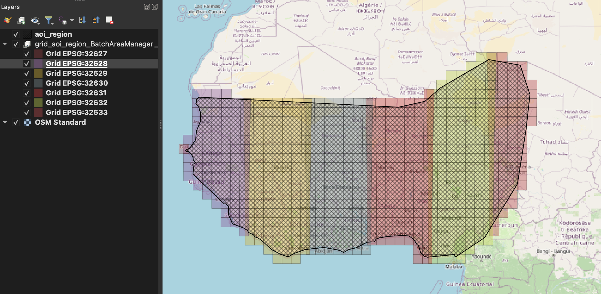

while the `tiffs` holds the output from Batch Processing. The `logs` contains the logs from running
the pipeline; things like successful/failed tasks, timings, and similar can be obtained from the
`report.html` file.


### Pipeline 2 - Loading the Data Cube into `EOPatches`

In the second pipeline, we restructure the output of the Data Cube into `EOPatches`. The config
to use is in `../config_files/large_scale_processing/input_data/batch_to_eopatch.json`, and we can try running the pipeline
like so (we can skip the `--start` if we still have the cluster running):

```bash
eogrow-ray infrastructure/cluster.yaml config_files/large_scale_processing/input_data/batch_to_eopatch.json
```

To test on single `EOPatch`, we can run

```bash
eogrow-ray infrastructure/cluster.yaml config_files/large_scale_processing/input_data/batch_to_eopatch.json -t 222
```

The `EOPatch` index number can be retrieved from the grid:

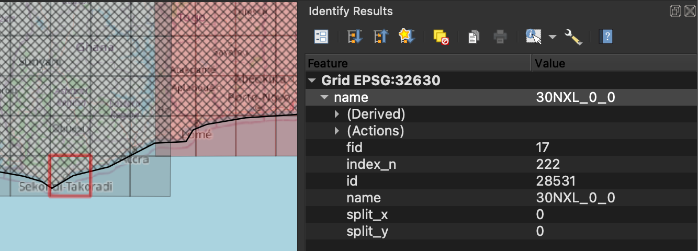

If everything is ok, we can now see `EOPatch` in the project folder structure:

```
└── data
    └── 2020
        ├── ...
        ├── 30NXL_0_0
        │   ├── data
        │   │   └── BANDS.npy.gz
        │   ├── mask
        │   │   └── QUALITY_MASK.npy.gz
        │   ├── bbox.geojson.gz
        │   ├── meta_info.json.gz
        │   └── timestamp.json.gz
        └── ...
```

### Pipeline 3 - Calculating features

This pipeline is a bit superfluous, as we could use evalscript in the first pipeline to
compute directly the features we are interested in, but we have decided to keep it in order
to show how we can compute features from band indices outside of Data Cube processing engine.

The config is written in [`features.json`](../config_files/large_scale_processing/input_data/features.json):

```javascript
// the pipeline class
"pipeline": "eogrow.pipelines.features.FeaturesPipeline",

// feature name containing satellite bands
"bands_feature_name": "BANDS",

// normalised density indices to compute, and corresponding array indices to use from the BANDS feature
"ndis": {
    "NDVI": [7,3],
    "NDWI": [2,7],
    "NDBI": [10,7]
},

// save output features under "FEATURES"
"output_feature_name": "FEATURES",

// if the features are already computed (available in the EOPatch), skip that EOPatch
"skip_existing": true
```

Again, running the pipeline is one command-line call away (remember to add `--start` if your cluster is not yet running):

```bash
eogrow-ray infrastructure/cluster.yaml config_files/large_scale_processing/input_data/features.json
```

After this, the project folder will have changed; sub-folder with `features/{year}` has been added, containing `EOPATCHES` with `data/FEATURES` numpy array:

```
└── features
    └── 2020
        ├── ...
        ├── 30NXL_0_0
        │   ├── data
        │   │   └── FEATURES.npy.gz
        │   ├── bbox.geojson.gz
        │   └── timestamp.json.gz
        └── ...
```

### Pipeline 4 - Retrieving reference data

In this example we will - for simplicity sake - use existing land cover classification result as training data. This pipeline will retrieve the data from Global Human Settlements Layer, which is a collection available through Sentinel Hub (see https://collections.sentinel-hub.com/global-human-settlement-layer-ghs-built-s2/). The config for this pipeline is available at [`reference_data.json`](../config_files/large_scale_processing/input_data/reference_data.json):


```javascript
  "pipeline": "eogrow.pipelines.download.DownloadEvalscriptPipeline",

  // specify parameters of the Sentinel Hub collection to be used
  "data_collection": {
    "name": "BYOC_3dbeea2c-3207-4c65-8a73-c29ce2675f89",
    "service_url": "https://creodias.sentinel-hub.com",
    "bands": [
      {"name": "PROB", "units": ["DN"], "output_types": ["uint8"]}
    ]
  },

  // the output will be stored wherever `raster_reference` StorageManager key is pointing to
  "output_folder_key": "raster_reference",

  // the output will be available in EOPatches as timeless data with name "GHSL_120"
  "features": [["data_timeless", "GHSL_120"]],
```

As you know by now, running the pipeline is one command-line call away (remember to add `--start` if your cluster is not yet running):

```bash
eogrow-ray infrastructure/cluster.yaml config_files/large_scale_processing/input_data/reference_data.json
```

and similarly as before, you can test the pipeline for single `EOPatch`:

```bash
eogrow-ray infrastructure/cluster.yaml config_files/large_scale_processing/input_data/reference_data.json -t 222
```

### Pipelines 5 - ML cycle

Next in line is the Machine Learning cycle:
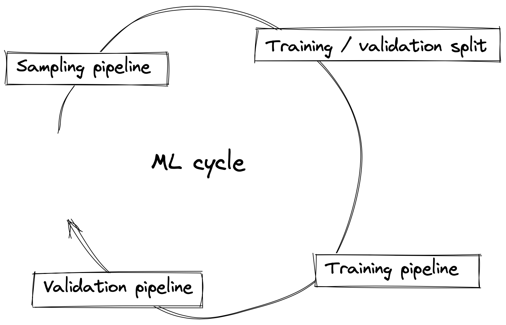

In this part, we will be running several pipelines, all of the connected to the preparation of the
model. We will sample the data we have and prepare a training and validation datasets, followed by
the pipeline to train a simple ML model.
#### Sampling pipeline

Sampling pipeline is defined in [`sampling.json`](../config_files/large_scale_processing/sampling/sampling.json) config file.
The most important parameters are:

```javascript
// the pipeline class to randomly sample blocks within EOPatch
"pipeline": "eogrow.pipelines.sampling.BlockSamplingPipeline",

// the EOPatch features the sampling should be applied to
"apply_to": {
    "features": {"data": ["FEATURES"]},
    "raster_reference": {
        "data_timeless": ["GHSL_120"]
    }
},

// sample size - in our case it is pixel sampling
"sample_size": [1,1],

// the output of the sampling mask
"mask_of_samples_name": "MASK_OF_SAMPLES",

// random seed to be used, very important for reproducibility of experiments
"seed": 42,

// number of samples to be created
"number_of_samples": 1500
```

`eo-grow` comes with several sampling pipelines, in our case we have used the `BlockSamplingPipeline`
which will sample random blocks (of `sample_size` pixels) from `EOPatch`. Useful for both pixel-based
approaches, where `sample_size = [1,1]` as well as deep learning, where patchlet size is used
(e.g. `sample_size = [32, 32]`).

To run the pipeline, use

```bash
eogrow-ray infrastructure/cluster.yaml config_files/large_scale_processing/sampling/sampling.json
```

#### Merging the samples for training

It is now time to merge the sampled pixel values into labels (`GHSL_120` features) and features
(the three indices we've computed in pipeline #3) into train and validation datasets that we can
later on use to train a model.

A simple [`merge_samples.json`](../config_files/large_scale_processing/sampling/merge_samples.json) config allows us to
do precisely that:

```javascript
// output the results into the folder accessible through StorageManager via key "training"
"output_folder_key": "training",

// list of samples (EOPatch features) to merge
"features_to_merge": [
    ["data", "FEATURES"],
    ["data_timeless", "GHSL_120"]
]
```

After running the pipeline with

```bash
eogrow-ray infrastructure/cluster.yaml config_files/large_scale_processing/sampling/merge_samples.json
```

the output will be in the `training-data` folder (remember, in the [`global_config`](../config_files/large_scale_processing/global_config.json)
we specify the `training` key will point to a folder named `training-data`):

```
└── training-data
    ├── FEATURES.npy
    └── GHSL_120.npy
```

#### Training pipeline

We are now ready to train the model. For this example, we have chosen a rather simplistic
`LGBMRegressor` regression model, implemented in `RegressionTrainingPipeline`. The
[`training.json`](../config_files/large_scale_processing/model/training.json) config holds the following parameters:

```javascript
// the pipeline class
"pipeline": "eogrow.pipelines.training.RegressionTrainingPipeline",

// the features to pass to the model
"train_features": ["FEATURES"],

// the labels/reference to pass to the model
"train_reference": "GHSL_120",

// test/train split ratio
"train_test_split": {
    "train_size": 0.8
},

// model parameters, as per https://lightgbm.readthedocs.io/en/v3.3.2/pythonapi/lightgbm.LGBMRegressor.html
"model_parameters": {
    "n_jobs": 8,
    "n_estimators": 400,
    "learning_rate": 0.01,
    "colsample_bytree": 0.66,
    "num_leaves": 200
},

// the file-name to store the model to
"model_filename": "gem-example_model.gz"
```

The pipeline can be run with:

```bash
eogrow-ray infrastructure/cluster.yaml config_files/large_scale_processing/model/training.json
```

If all is ok, you will see something similar in the output:
```
INFO eogrow.core.pipeline:236:   	    Running RegressionTrainingPipeline
INFO eogrow.pipelines.training:80:	    Preparing data
INFO eogrow.pipelines.training:109:	    Reading input features
INFO eogrow.pipelines.training:120:     Reading input reference
INFO eogrow.pipelines.training:135:     Making a random train-test split, using 0.8 of data for training.
INFO eogrow.pipelines.training:83:	    Training. This could take a while.
INFO eogrow.pipelines.training:86:	    Saving.
INFO eogrow.pipelines.training:164:	    Saving to gem-example_model.gz
INFO eogrow.pipelines.training:89:	    Scoring results.
INFO eogrow.pipelines.training:267:	    Mean Square Error:	 17.3211
INFO eogrow.pipelines.training:268:	    Root Mean Square Error:	 4.1619
INFO eogrow.pipelines.training:269:	    Mean Average Error:	 0.5435
INFO eogrow.pipelines.training:270:	    R2 Score:	 0.2915
INFO eogrow.core.pipeline:248:   	    Pipeline finished successfully!
```

We can see clearly that the model is not very good, but the point is to guide you through the whole workflow.
That is why we will now - regardless of the model accuracy - run the predictions over whole area.

### Pipeline 6 - Running predictions

Configuration for the inference using the model we've just trained is stored in
[`prediction.json`](../config_files/large_scale_processing/model/prediction.json) config:

```javascript
// the pipeline class
"pipeline": "eogrow.pipelines.prediction.RegressionPredictionPipeline",

// where to store outputs
"output_folder_key": "predictions",

// where are inputs (features)
"input_features": [["data", "FEATURES"]],

// the EOPatch feature to store results to
"output_feature_name": "test_prediction",

// the model to use
"model_folder_key": "models",
"model_filename": "gem-example_model.gz"
```

Running
```bash
eogrow-ray infrastructure/cluster.yaml config_files/large_scale_processing/model/prediction.json
```

we get predictions:

```
└── predictions
    ├── 30NXL_0_0
    │   ├── data_timeless
    │   │   └── test_prediction.npy.gz
    │   └── bbox.geojson.gz
    └── ...
```

### Pipeline 7 - Exporting Maps

If we have a look at the prediction for this `EOPatch`:

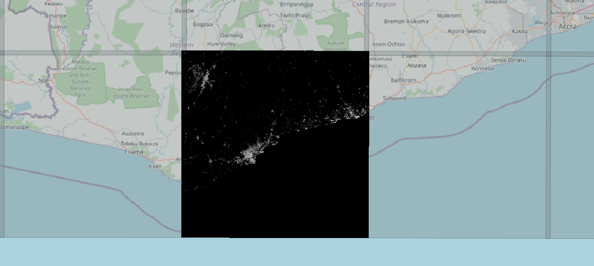

we still see that regardless of the model performance, and in particular for 120 m
resolution, the results are not really bad.

The "Exporting maps" pipeline allows us to export maps for all `EOPatches` in one go.
The [`export_predictions.json`](../config_files/large_scale_processing/results/export_predictions.json) config
allows us to define the following parameters:

```javascript
// the pipeline class
"pipeline": "eogrow.pipelines.export_maps.ExportMapsPipeline",

// where the inputs are (in our case test_prediction features)
"input_folder_key": "predictions",

// where to write the output
"output_folder_key": "maps",

// the EOPatch feature to export
"feature": ["data_timeless", "test_prediction"],

// which indices (of possibly multi-dimensional feature) to export
"band_indices": [0],

// the name of the exported file
"map_name": "result.tiff",

// data type of the resulting tiff
"map_dtype": "uint8",

// produce cloud optimised geotiff
"cogify": true
```

Running
```bash
eogrow-ray infrastructure/cluster.yaml config_files/large_scale_processing/results/export_predictions.json
```

we get one file per UTM zone of our grid:
```
└── maps
    ├── utm32627_result.tiff
    ├── ...
    └── utm32633_result.tiff
```

Loading one, we see that predictions from `EOPatches` were merged:
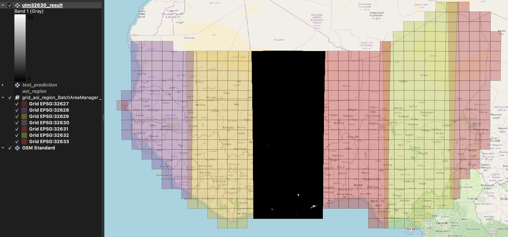

This is already a big step towards something that can be shared, and easily visualized, but the
next pipeline takes it a step further.

### Pipeline 8 - Ingesting Maps to Sentinel Hub

With the predictions exported as tiffs (actually, cloud optimised geotiffs - COGs), we can take
a step further, and ingest our results back to Sentinel Hub. This way, we get API access to our
predictions that works in exactly the same way as for any (satellite or other) data, available
through Sentinel Hub. The pipeline relies on Sentinel-Hub's Bring your own COGs
([BYOC](https://docs.sentinel-hub.com/api/latest/api/byoc/)) functionality, so the exported maps
need to be available on object storage, and the bucket itself has to be properly
[set up](https://docs.sentinel-hub.com/api/latest/api/byoc/#bucket-settings).

The [`ingest_to_sentinelhub.json`](../config_files/large_scale_processing/results/ingest_to_sentinelhub.json) config
defines the parameters of the pipeline that will run the ingestion. It is a relatively simple
config, as most of the information needed is already encoded either in the managers or in
the exported tiffs.

```javascript
// the pipeline class
"pipeline": "eogrow.pipelines.byoc.IngestByocTilesPipeline",

// where the data for BYOC is
"byoc_tile_folder_key": "maps",

// BYOC collection name
"new_collection_name": "GEM eo-grow example predictions",

// provide a "time" to assign to the collection
"sensing_time": "2020-12-31",

// extra parameters to "cut" the resulting maps to some geometry
// in our case that would be the original AOI
"cover_geometry_folder_key": "input_data",
"cover_geometry": "aoi_region.geojson"
```

After successfully running the pipeline with

```bash
eogrow-ray infrastructure/cluster.yaml config_files/large_scale_processing/results/ingest_to_sentinelhub.json
```

we can see the collection among "My collections" on Sentinel Hub [dashboard](https://apps.sentinel-hub.com/dashboard):

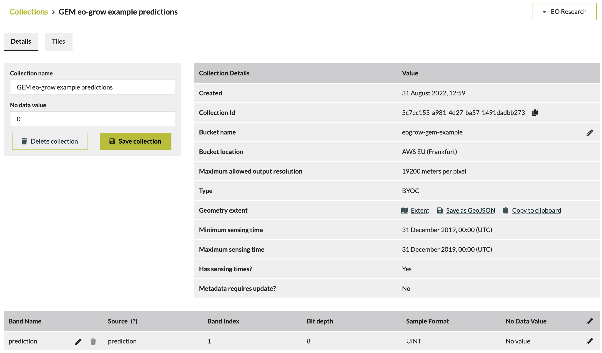

The tiles, available in this BYOC collection are the exported per-UTM tiff files from previous pipeline:

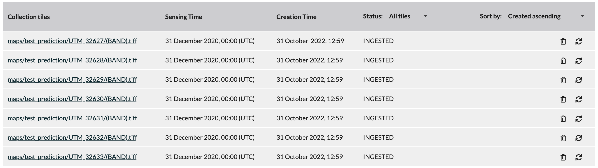

and their geometries are clipped to AOI:

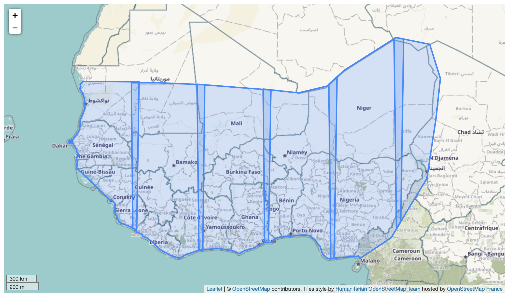

We can now use this collection to display it on a web page, in QGIS, use it in `eo-learn`, `eo-grow`, with
Python, javascript, ... in exactly the same way as we'd use any other Sentinel Hub data collection (e.g. Sentinel-2).

For instance, a nicer visualization of results, retrieved as WMS layer from QGIS:

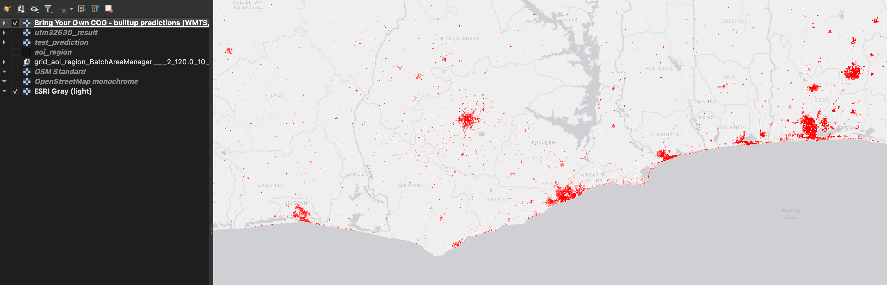

## Conclusion

The example showcases running an end to end generic EO workflow using `eo-grow` with Ray clusters on AWS
infrastructure. The `eo-grow` package, developed within the GEM project, is still in early stages, and can
be subject to some significant changes in the near future. Nevertheless, the functionalities presented here
are the backbone of the EO workflows, so should be here to stay.

You are invited to take the example, adapt it to your needs, use it and possibly even contribute back, both
to `eo-grow` as well as to the repository with examples.
