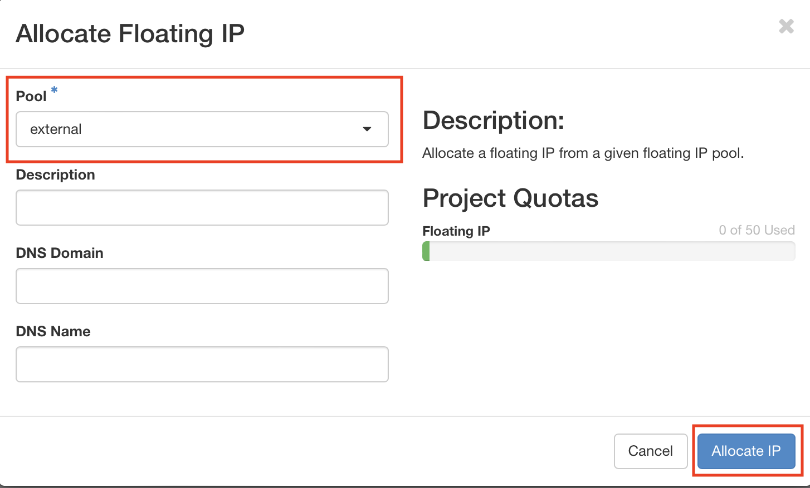

# eo-grow on [Copernicus Data Space Ecosystem](https://dataspace.copernicus.eu/ecosystem)

In this document we explain how to set-up an CDSE instance which you can utilize for running eo-grow workflows in the cloud. This allows us to

## Table of contents

[TOC]

## Prerequisites

* You need access to the CDSE [cloud computing platform](https://horizon.cloudferro.com/project/). You can [register](https://portal.creodias.eu/register.php) on CreoDIAS and use those credentials.

* !! TODO: Check how users can get access to this? !!


## Network setup

In order for the VM to be accessible from the internet, we need to add a floating IP to it.  This is done by following the [steps in the documentation](https://creodias.eu/-/how-to-add-floating-ip-to-vm-from-external2-pool-?inheritRedirect=true&redirect=%2Ffaq-networking).

We will adapt the steps a bit in-order to make  the process stremlined for our usecase. Please follow the steps outlined below:

1. **Create a new router**

To assign a Floating IP from a specific pool to a VM, a router that supports the private network of that VM must be connected to the same pool.

Go to Project → Network → Routers.


Create a new router by clicking the **Create Router** button.


Then complete field name of the router and choose "external2" in External Network field. Click the **Create Router** to confirm.


**2. Create a new network**

After creating the router, go to Project → Network → Networks and create a new network by clicking the **Create Network** button.


Choose the name for the new network and click the **Next** button.


Choose Subnet name and set

Network Address: 192.168.1.0/24

 and

Gateway IP: 192.168.1.1

and click the **Next** button.


Set a range of allocation pools (e.g. 2 - 254) and set DNS Name Servers:

* 185.48.234.234

* 185.48.234.238

* 8.8.8.8

and click the **Create** button


After the network is created, it will be visible in network menu.


After the network has been created go back to Project → Network → Routers and select new router.


Then choose "Interface" bookmark.


Add a new interface by clicking on the **Add Interface** button.


Select the newly created Subnet and click the **Submit** button.


After adding Interface it will be visible in the Interface menu.


## Security groups

We also need to adjust the default security group to allow connections via SSH. Navigate to Network -> Security Groups and the select Manage Rules.


  Then select Add Rule


And add `Ingress` permission to access port `22` from everywhere (`0.0.0.0/0`). Note that you can also restrict access by specifying a fixed IP if you have one.


## Key Pairs

You will also need to create a Key Pair in order to be able to access the instance.  Navigate to Compute -> Key Pairs and select "Create Key Pair".


Name the key pair with some name, i.e. `gem-example-key` and select `SSH Key`  as Key Type and click on "Create Key Pair"


## Creating a VM

We are now ready to create our virtual machine. To do this, you can follow the steps outlined below.

Navigate to Compute  -> Instances - Launch Instance.


first you need to set the instance name which can be whatever you want, in our case we set it to `gem-example-vm`


the need to set the source, i.e. which base image we are using. Here, we first search for "Open" and choose the `Ubuntu 20.04 LTS OpenDataCube` image, since it already has a lot of the packages that we need available. We select it by click on t he up arrow button.


then we need to  choose  Flavour, which is the instance type. For this (lightweight) example we choose `hma.medium`which has 2 virtual CPUs and 16GB of RAM. In general this is chosen based on the computing demands of our eo-grow workflow. We select the instance type by clicling on the up arrow symbol as highlighted below.


then we need to select the network. We choose the `private_network_external2` that we created in the previous section. Again, this is selected by clicking on the up arrow symbol.


If we only have one security group (default), the security group will already be selected. If not, please use the security group that you modified in the previous section.


If we only have one key pair created, it  will already be allocated. If not, please use a key pair of your choosing. Make sure that you have the key pair available, as it is needed to access the instance.


After setting all the required parameters, we can start the instance by click on the `Launch instance` button.  The spawned instance will be visible in the Compute -> Instances menu.


Note that the instance doesn't have a public IP yet. To assign it one, go to Project → Network → Floating IPs and select **Allocate IP To Project**.


Choose "external" from Pool field and click **Allocate IP**.



Select IP Address you have just created and click **Associate** button.


After selecting IP Address and Port click the **Associate** button..


If we navigate back to the Compute -> Instance we now see that the instance has an external IP allocated to it. This is the IP that we will use to connect to the instance.


## Connecting via SSH

Note that these instructions are written for UNIX based systems. For Windows, a client like [PuTTY](https://www.putty.org) may be used to connect via SSH.

It is recommend to create a SSH configuration which will enable us to connect. To do that add the following entry to the `~./ssh/config` file. Fill in the `Hostname` parameter with the external IP allocated in the previous step and fill in the `IdentityFile` parameter with the path to the keypair file that was created in the `Key Pairs` section.

```
Host gem-cdse-example
  Hostname <Allocated iP from previous step>
  Port 22
  LocalForward 8090 localhost:8090
  LocalForward 6006 localhost:6006
  User eouser
  IdentityFile <path_to_keypair_file>/gem-example-keypair.pem
```

Once the entry has been added, we can connect to the instance with the below command. If you are prompted for the keys, write Yes and press Enter.

```bash
ssh gem-cdse-example
```

Once on the instance, we clone the eo-grow-repository, install the requirements  and then launch the jupyter-lab server on the 8090 port.

```bash
git clone https://github.com/sentinel-hub/eo-grow-examples.git
pip install -r eo-grow-examples/GEM/requirements.txt
jupyter-lab --port 8090
```

Once the jupyter server starts, we will get a link in the terminal that we copy paste into our web browser. This allows us to access  the jupyter lab environment running on the VM.


##  Running the notebook

Once on the notebook, we navigate to eo-grow-examples/GEM and open `example_notebook.ipynb`

We now follow the instructions in the notebook and run as if it were local.


