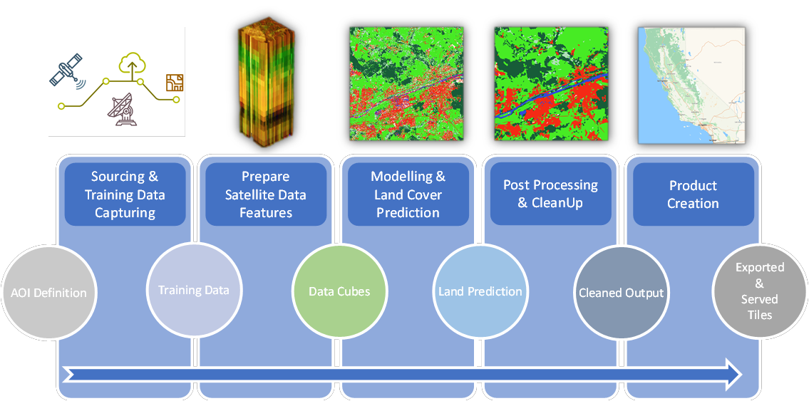
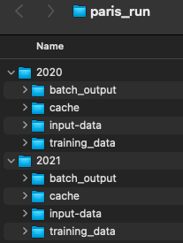

# Land Cover Continuous Monitoring Service (LC-CMS) Workshop

# A : Pre-Requirsites
- Docker engine >= 10.0
- QGIS : To visualize the Predictions & Results. Template for the project is provided in this repository.
- Local disk space ~ 3GB
- RAM >= 4 GB
- Optional things :
    - SentinelHub Account( If you want to visualize using BYOC services / EOBrowser). This will also require an S3 bucket which should be accessible using the SH. This will not be covered in this workshop but links will be provided so, that you can do it yourself.
    
## A.1 : Dataset for the Notebook (***Very Important***) :
In order to run this Notebook, we'll need some dataset on which we can perform Land Classification. We'll use the dataset already prepared for Paris region for the purpose of this exercise, so **please make sure to download it before the workshop using following steps** : 
1. Download the data from the following download link : 
    https://cloud.sinergise.com/s/TJnrDjbT2tpiGA2

     Alternatively, you can use following wget command : 

`wget https://cloud.sinergise.com/s/TJnrDjbT2tpiGA2/download/paris_run.zip -O paris_run.zip`

2. The first step will download a **paris_run.zip** file. You can unzip it on your machine for now. 

**You will need this later while running the docker image, where you'll mount this directory to the docker container.**

The downloaded dataset `paris_run` should have data for two years **2020 & 2021** with following structure : 

## A.2 : QGIS Template for Visualizing the results
There is QGIS directly in the repository, which contains the project file => **lc_cms_reslut_viewer.qgz**. 
Import it as a project in QGIS so that you can visualize the results later on.

# B : How to run this notebook ?
## B.1 : If you're using Docker :
There is an associated Dockerfile in this repository, which installs all the necessary packages required to run this notebook. 

Additionaly, once the dockerfile is run, it also spins up a jupyter notebook in the container which can be accessed using a public port.
1. As a first step, you can build the docker image by going to the home directory using command :

`
docker build -t gem-workshop:latest .
`

2. Next run the docker image which starts a jupyter notebook (Please make sure the port that you are using is not being using by some other process):

`
docker run -p 8888:8888 -v $(pwd):/gem-workshop -v $paris_run:/gem-workshop/paris_run -t gem-workshop:latest
`

**Note : `$paris_run` must be replaced by path to directly where you have downloaded the data as mentioned in section pre-requisites A.1**

**If you're on windows You will have to replace $(pwd) with path to the `LC_CMS_Workshop` in the checked out repository.**

3. You can now go to the link http://localhost:8888 and enter the password as **`gem`**. Then, open the jupyter notebook at location notebook/LC-CMS_Workshop.ipynb.

## B.2 : If you are not using Docker :
As an alternate if you are not using the Docker, you can install the following requirements/packages manually :
- Python >= 3.9
- Gdal binaries >= 3.23
- Gdal-python >= 3.23
- All the packages listed in requirements.txt of this repo :
   - sentinelhub>=3.6.3
   - eo-learn==1.3.1
   - eo-grow==1.3.3
   - geopandas==0.12.2
   - scikit-learn==1.2.0
   - scikit-image==0.19.3
   - scipy==1.10.0
   - juypyterlab
   
## Contact Details :
### Ashish Dhiman
#### Work Email : ashish.dhiman@tomtom.com
#### Personal Email : ashish.dhiman.nith@gmail.com
#### LinkedIn : https://www.linkedin.com/in/ashishdhiman89/